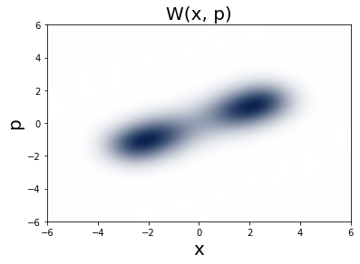

============================================================
Superradiance: Qubits in a cavity
============================================================
We consider a system of :math:`N` two-level systems (TLSs) coupled to a cavity mode. This is known as the Dicke model 

.. math::

	H = \omega_{0}J_z +  \omega_{c}a^\dagger a + g\left(a^\dagger + a\right)\left(J_{+} + J_{-}\right)

where each TLS has identical frequency :math:`\omega_0`. The light matter coupling can be in the ultrastrong coupling (USC) regime, :math:`g/ \omega_0 >0.1`.

If we study this model as an open quantum system, the cavity can leak photons and the TLSs are subject to local processes. For example the system can be incoherently pumped at a rate :math:`\gamma_\text{P}`, the TLSs are subject to dephaisng at a rate :math:`\gamma_\text{D}`, and local incoherent emission occurs at a rate :math:`\gamma_\text{E}`. The dynamics of the coupled light-matter system is governed by

.. math::

	\dot{\rho} = -i\lbrack \omega_{0}J_z +  \omega_{a}a^\dagger a + g\left(a^\dagger + a\right)\left(J_{+} + J_{-}\right),\rho \rbrack
	
	+\frac{\kappa}{2}\mathcal{L}_{a}[\rho]
	+\sum_{n=1}^{N}\left(\frac{\gamma_\text{P}}{2}\mathcal{L}_{J_{+,n}}[\rho] 
	+\frac{\gamma_\text{E}}{2}\mathcal{L}_{J_{+,n}}[\rho]
	+\frac{\gamma_\text{D}}{2}\mathcal{L}_{J_{+,n}}[\rho]\right)
	\ \ \ \ \ \ (1)

.. code-block:: python

	import matplotlib.pyplot as plt
	from qutip import *
	from piqs import *

	#TLS parameters
	N = 6
	nds = num_dicke_states(N)
	[jx, jy, jz] = jspin(N)
	jp, jm = jspin(N, "+"), jspin(N, "-")
	w0 = 1
	gE, gD = 0.1, 0.01

	# Hamiltonian
	h = w0 * jz

	#photonic parameters
	nphot = 20
	wc = 1
	kappa = 1
	ratio_g = 2
	g = ratio_g/np.sqrt(N)
	a = destroy(nphot)

After defining all the parameters, we can build a Liouvillian for the TLS ensemble and the photonic cavity. In order to study this system using QuTiP and :math:`PIQS`, we will first build the TLS Liouvillian, then we will build the photonic Liouvillian and finally we will build the light-matter interaction. The total dynamics of the system is thus defined in a Liouvillian space that has both TLS and photonic degrees of freedom. 

.. code-block:: python
	
	#TLS liouvillian
	ensemble = dicke(N = N, hamiltonian=h, emission=gE, dephasing=gD)
	liouv = ensemble.liouvillian()

	#photonic liouvilian
	h_phot = wc * a.dag() * a
	c_ops_phot = [np.sqrt(kappa) * a]
	liouv_phot = liouvillian(h_phot, c_ops_phot)

We can then make a light-matter superoperator to address the total system of N spins and the photonic cavity by the `super_tensor` function in QuTiP. Similarly, the Liouvillian for the interaction Hamiltonian can be constructed with the `spre` and `spost` functions representing pre and post multiplication super-operators to finally construct the total Liouvillian of the combined light-matter system.

.. code-block::python

	# identity operators
	id_tls = to_super(qeye(nds))
	id_phot = to_super(qeye(nphot))

	# light-matter superoperator
	liouv_sum = super_tensor(liouv_phot, id_tls) + super_tensor(id_phot, liouv)

	# total liouvillian
	h_int = g * tensor(a + a.dag(), jx)
	liouv_int = -1j* spre(h_int) + 1j* spost(h_int)
	liouv_tot = liouv_sum + liouv_int

A similar treatment is possible for any operator and we construct the total :math:`J_z, J_+ J_-` superoperators.

.. code-block::python

	#total operators

	jz_tot = tensor(qeye(nphot), jz)
	jpjm_tot = tensor(qeye(nphot), jp*jm)
	nphot_tot = tensor(a.dag()*a, qeye(nds))

When only the dissipation of the cavity is present, beyond a critical value of the coupling :math:`g`, the steady state of the system becomes superradiant. This is visible by looking at the Wigner function of the photonic part of the density matrix, which displays two displaced lobes in the :math:`x` and :math:`p` plane.

.. code:: python
    
	rho_steady_state = steadystate(liouv_tot)
	jz_steady_state = expect(jz_tot, rho_steady_state)
	jpjm_steady_state = expect(jpjm_tot, rho_steady_state)
	
	nphot_steady_state = expect(nphot_tot, rho_steady_state)
	psi = rho_steady_state.ptrace(0)
	xvec = np.linspace(-6, 6, 100)
	W = wigner(psi, xvec, xvec)

	wmap = wigner_cmap(W)  # Generate Wigner colormap
	nrm = mpl.colors.Normalize(0, W.max())
	plt.contourf(xvec, xvec, W, 100, cmap=wmap, norm=nrm)
	plt.show()

As it has been shown in Ref. [1], the presence of dephasing suppresses the superradiant phase transition, while the presence of local emission restores it [2].

References:

.. [1] Kirton, Peter, and Jonathan Keeling. "Suppressing and restoring the dicke superradiance transition by dephasing and decay." Physical review letters 118.12 (2017): 123602.
