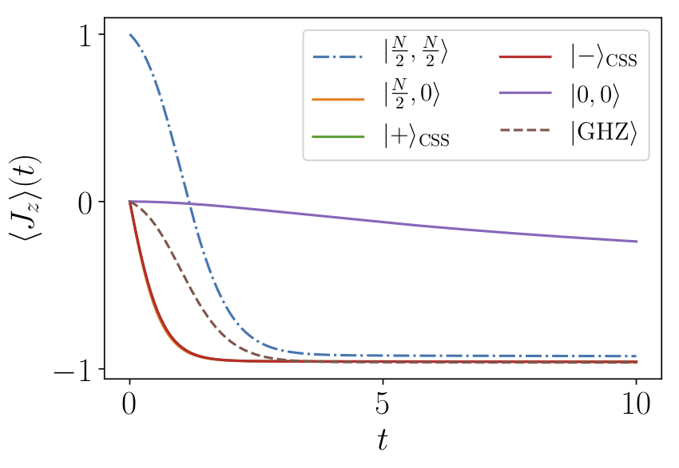

============================================================
Superradiant Light Emission 
============================================================
We consider a system of :math:`N` two-level systems (TLSs) with identical frequency :math:`\omega_{0}`, which can emit collectively at a rate :math:`\gamma_\text{CE}`, and suffer from dephasing and local losses at rates :math:`\gamma_\text{D}` and :math:`\gamma_\text{E}`, respectively. The dynamics can be written as

 .. math::
    \dot{\rho} =-i\lbrack \omega_{0}J_z,\rho \rbrack
    +\frac{\gamma_\text {CE}}{2}\mathcal{L}_{J_{-}}[\rho]
    +\sum_{n=1}^{N}\frac{\gamma_\text{D}}{2}\mathcal{L}_{J_{z,n}}[\rho]
    +\frac{\gamma_\text{E}}{2}\mathcal{L}_{J_{-,n}}[\rho].

When :math:`\gamma_\text{E}=\gamma_\text{D}=0` this dynamics is the classical superradiant master equation.
In this limit, a system initially prepared in the fully-excited state undergoes superradiant light emission whose peak intensity scales proportionally to :math:`N^2`.

.. code-block:: python

    from qutip import *
    from piqs import *
    import matplotlib.pyplot as plt

    N = 20
    [jx, jy, jz] = jspin(N)
    jp = jspin(N, "+")
    jm = jp.dag()
    
    # spin hamiltonian
    w0 = 1
    H = w0 * jz

    # dissipation
    gCE, gD, gE = 1, 1, 0

    # set initial conditions for spins
    system = Dicke(N=N, hamiltonian=h, dephasing=gD,
                   collective_emission=gCE)

    # build the Liouvillian matrix  
    liouv = system.liouvillian()

Now that the system Liouvillian is defined, we can use QuTiP to solve the dynamics.
We use as integration time a multiple of the superradiant delay time, :math:`t_\text{D}=\log(N)/(N \gamma_\text{CE})`. We specify the operators for which
the expectation values should be calculated to `mesolve` with the keyword
argument `e_ops`. In this case, we are interested in :math:`J_x, J_+ J_-, J_z^2`.

.. code-block:: python

    nt = 1001
    td0 = np.log(N)/(N*gCE)
    tmax = 10 * td0

    t = np.linspace(0, tmax, nt)
    
    # initial state
    excited_rho = excited(N)
    
    # alternative states 
    superradiant_rho = dicke(N, N/2, 0)
    subradiant_rho = dicke(N, 0, 0)
    css_symmetric = css(N)
    
    a = 1/np.sqrt(2)
    css_antisymmetric = css(N, a, -a)
    ghz_rho = ghz(N)
    rho0 = excited_rho
    result = mesolve(liouv, rho0, t, [], e_ops = [jz, jp*jm, jz**2], 
                     options = Options(store_states=True))
    rhot = result.states

We can then plot the results of the time evolution of the expectation values of the collective spin operators for different initial states. 

.. code-block:: python
    
    
    jz_t = result.expect[0]
    jpjm_t = result.expect[1]
    jz2_t = result.expect[2]
    
    jmax = (0.5 * N)
    fig1 = plt.figure()
    plt.plot(t/td0, jz_t/jmax)
    plt.show()
    plt.close()

References:

.. [1] Dicke, R. H.
                "Coherence in Spontaneous Radiation Processes". 
                Phys. Rev. 93, 91 (1954)
                doi/10.1103/PhysRev.93.99.
.. [2] Bonifacio, R. and Schwendimann, P. and Haake, Fritz.
                "Quantum Statistical Theory of Superradiance. I."
                Phys. Rev. A 4, 302 (1971)
                doi:10.1103/PhysRevA.4.302
